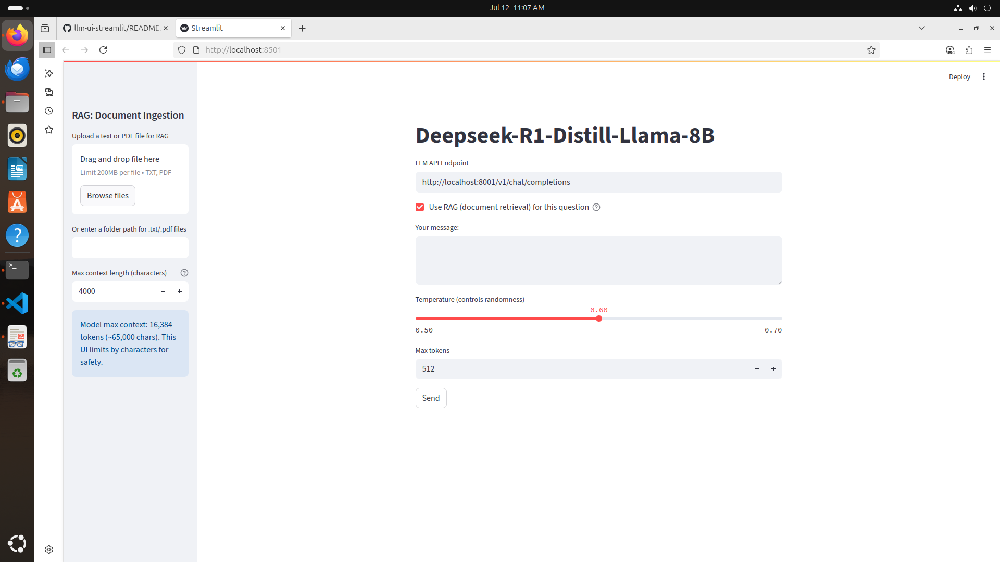

# Deepseek-R1-Distill-Llama-8B Streamlit UI

A simple Streamlit-based web UI for chatting with the Deepseek-R1-Distill-Llama-8B model (or any local LLM server with an OpenAI-compatible API).

**Model Card:** [Deepseek-R1-Distill-Llama-8B on build.nvidia.com](https://build.nvidia.com/deepseek-ai/deepseek-r1-distill-llama-8b/deploy)

> **Note:** This model is running in a local Docker container.



## New Features (v0.09)
- RAG (document retrieval) can be enabled/disabled per question with a checkbox.
- RAG source references now show document name and page number (for PDFs), and are clickable if the file exists.
- User can control the number of RAG references shown per answer.
- Increased default max_tokens to 512 for more complete answers.
- Improved PDF ingestion: page numbers are tracked and shown in references.

## Features
- Enter your message and get responses from a local LLM
- Configurable LLM API endpoint (default: OpenAI-compatible)
- Model name set to `deepseek-ai/deepseek-r1-distill-llama-8b` (can be changed in code)
- Set temperature (0.5–0.7, default 0.6) in the UI
- Set max tokens (default 64) in the UI
- Error handling and response format debugging
- **RAG (Retrieval-Augmented Generation):** Upload or point to a folder of `.txt` or `.pdf` files and chat with your documents! Relevant context is retrieved and sent to the LLM for more informed answers. You can enable/disable RAG per question, and see clickable source references with page numbers for PDFs.
- **Max context length control:** UI slider lets you set the max context sent to the LLM (default 4,000 chars, up to 65,000 chars for Deepseek).

## Requirements

- Python 3.8+
- All required Python packages are listed in `requirements.txt`.
- A local LLM server with an OpenAI-compatible API (e.g., LM Studio, OpenRouter, etc.)
- (Optional) `gnome-screenshot` (Linux utility for screenshots)

## Setup
1. Clone this repository:
   ```bash
   git clone https://github.com/batx123/llm-ui-streamlit.git
   cd llm-ui-streamlit
   ```
2. (Optional) Create and activate a virtual environment:
   ```bash
   python3 -m venv .venv
   source .venv/bin/activate
   ```
3. Install dependencies:
   ```bash
   pip install -r requirements.txt
   # (Optional, for screenshots on Linux)
   sudo apt-get install gnome-screenshot
   ```
4. Start your local LLM server (ensure the endpoint and model name match your setup).
   
   If you are using the official Deepseek Docker image, you can start the server with:
   ```bash
   docker run -it --rm \
       --gpus all \
       --shm-size=16GB \
       -e NGC_API_KEY \
       -v "$LOCAL_NIM_CACHE:/opt/nim/.cache" \
       -u $(id -u) \
       -p 8001:8000 \
       nvcr.io/nim/deepseek-ai/deepseek-r1-distill-llama-8b:1.5.2
   ```
   
   > **Note:** The example above maps the container's port 8000 to host port 8001 (`-p 8001:8000`). This is to avoid conflicts if port 8000 is already in use. You can use `-p 8000:8000` if your system is not already using that port.
5. Run the Streamlit app:
   ```bash
   streamlit run llm_ui.py
   ```
6. Open your browser to [http://localhost:8501](http://localhost:8501)

## Screenshot
To take a screenshot of the UI, run:
```bash
python take_screenshot.py
```
This will save a screenshot as `screenshot.png` in the project directory. The README always shows the latest UI screenshot.

## Configuration
- Change the API endpoint in the UI or edit the `default_llm_url` in `llm_ui.py`.
- Change the model name, temperature, and max tokens in the UI or code as needed.
- Use the sidebar to upload or point to a folder of `.txt` or `.pdf` files for RAG.
- Use the sidebar slider to control max context length (default 4,000 chars, up to 65,000 chars for Deepseek).

## Example LLM API Compatibility
- OpenAI-compatible endpoints: `/v1/chat/completions`
- LM Studio, OpenRouter, Ollama, etc. (adjust endpoint and payload as needed)

## Documentation
- See [FAQ.md](FAQ.md) for common questions.
- See [SCREENSHOT.md](SCREENSHOT.md) for a screenshot reference.

## License
MIT
